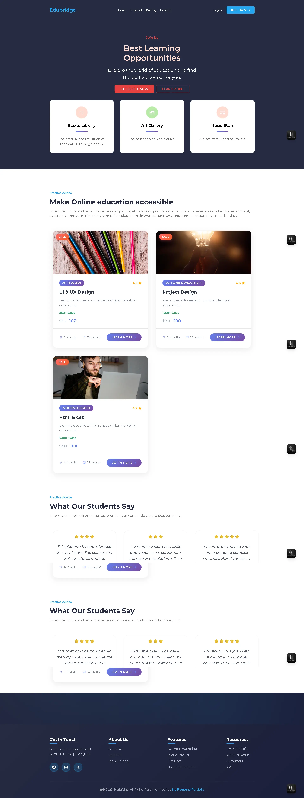

# ⚡ EduBridge - React + Vite

<div align="center">
  
</div>

<div align="center">


</div>

> 🚀 **EduBridge** - A modern, lightning-fast educational platform built with React and Vite, featuring Hot Module Replacement (HMR) and professional ESLint configuration.

## ✨ Features

- ⚡ **Lightning Fast** - Powered by Vite's instant server start
- 🔥 **Hot Module Replacement** - See changes instantly without losing state
- 📏 **ESLint Integration** - Code quality and consistency out of the box
- 🛠️ **Modern Tooling** - Latest React and Vite configurations

## 🔧 Available Plugins

Choose your preferred Fast Refresh implementation:

### 🎯 [@vitejs/plugin-react](https://github.com/vitejs/vite-plugin-react/blob/main/packages/plugin-react)

- Uses [Babel](https://babeljs.io/) for Fast Refresh
- More mature ecosystem
- Extensive plugin support

### ⚡ [@vitejs/plugin-react-swc](https://github.com/vitejs/vite-plugin-react/blob/main/packages/plugin-react-swc)

- Uses [SWC](https://swc.rs/) for Fast Refresh
- Faster compilation times
- Rust-powered performance

## 🚀 Quick Start

### Prerequisites

- Node.js (v16 or higher)
- npm or yarn package manager

### Installation

```bash
# Clone the repository
git clone <repository-url>
cd edubridge

# Install dependencies
npm install

# Start development server
npm run dev

# Build for production
npm run build

# Preview production build
npm run preview
```

### 🌐 Development Server

Once started, your application will be available at:

- **Local**: http://localhost:5173
- **Network**: Use the network URL shown in terminal for mobile testing

## 📈 Production Ready

For production applications, consider upgrading to **TypeScript** with type-aware lint rules:

- 📚 Check out the [TypeScript template](https://github.com/vitejs/vite/tree/main/packages/create-vite/template-react-ts)
- 🔍 Integrate [`typescript-eslint`](https://typescript-eslint.io) for enhanced code quality
- 🛡️ Enable type-aware linting rules for better error detection

## 📁 Project Structure

```
edubridge/
├── public/          # Static assets
├── src/             # Source code
│   ├── components/  # React components
│   ├── assets/      # Images, fonts, etc.
│   ├── styles/      # CSS/SCSS files
│   └── main.jsx     # Application entry point
├── index.html       # HTML template
└── vite.config.js   # Vite configuration
```

## 🤝 Contributing

1. Fork the repository
2. Create your feature branch (`git checkout -b feature/AmazingFeature`)
3. Commit your changes (`git commit -m 'Add some AmazingFeature'`)
4. Push to the branch (`git push origin feature/AmazingFeature`)
5. Open a Pull Request

## 📄 License

This project is licensed under the MIT License - see the [LICENSE](LICENSE) file for details.

---

<div align="center">
  <p><strong>EduBridge</strong> - Bridging Education with Technology</p>
  <p>Built with ❤️ using React and Vite</p>
  <p>© 2025 EduBridge. All rights reserved by  <a
              href="https://my-frontend-portfolio-sage.vercel.app/"
              target="_blank"
            >
              My Frontend Portfolio
            </a></p>
</div>
